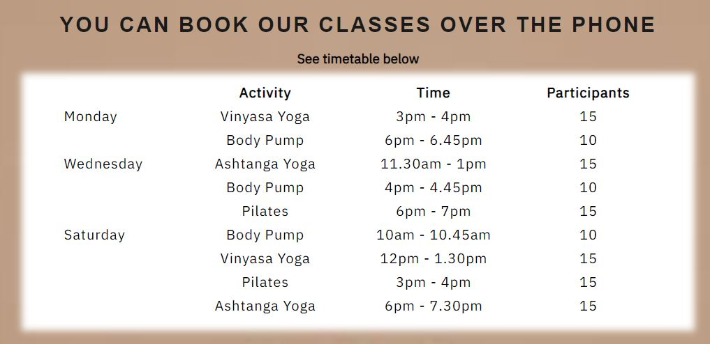
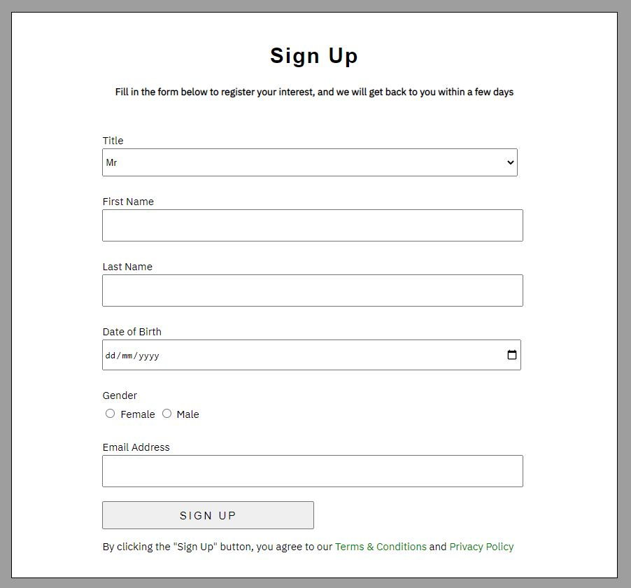

# DunkeldFitnessCentre
First Milestone Project: a site to show facilities of a fictional gym

The website details information about a gym which offers all standard facilities of a gym, workout classes, and a monthly or annual membership.  

The Homepage is attractive and minimalist, yet clear in terms of fundamental information about the gym (eg contact details, location) and how to navigate to other pages.

The Facilities page displays the different rooms found in the fitness center such as a weights room and a cardio room, the variation and volume of equipment, and other facility information which users might want to know such as changing rooms, showers, parking details etc. 

The Classes page features a class timetable which details the type of classes which run, the day and time that they run, the quantity of people the user can expect to find in the class, and how to go about booking them. 

The Membership page details what the membership includes, incentives to join this particular fitness centre over others, price information and a form to sign up for a membership if the user is interested.

The contact page - About Us - is very basic, detailing the contact details of the gym, links to social media pages, opening times and a Google maps location of the gym.

The footer appears on all pages, and displays top level information about the gym, such as contact details, opening times, location, and a link back to the Homepage. 

# Features

## Main Features

### Navigation Bar

The navigation is fixed to the top of the page, allowing the user to return to it at any time to navigate to another page.  All pages are displayed in the navigation bar.  

The text is an appropriate size and there is adequate spacing between each page title to clearly see what the pages are.  

The active page has the page title a different colour to remind the user where they are within the website, and there is a hover function to allow the user to see when the mouse point is above the hyperlink.

Lastly, for emphasis and to remind the user how to return to the front page, the Homepage title sits furthest to the left, as in first in the navigation bar, and has the branded logo for the gym. 

### Footer

The footer displays all important top level information about the gym.  It largely consists of contact information.

Furthest to the left, similar to the navigation bar, sits the Dunkeld Fitness Center and logo, which can hyperlink back to the Homepage when clicked.  

The footer is responsive to different screen sizes.  In particular, for pages which only need to take up 1 screen height - Homepage, About Us - the footer is fixed and always in view.  For pages with more content - Facilities, Membership, Classes - the footer sits at the bottom.  When the screen width is decreased, the footer format changes to a list style as opposed to four columns of information, which results in the footer being much taller than at bigger screen sizes.  To avoid the footer filling almost the entire screen and smaller screen sizes, the footer stops being fixed and always viewable, and sits at the very bottom of the page.

Lastly, the footer background colour changes with each page, to match the colour theme of the page and is thus more pleasing to the user. 

## Homepage

### Main Image
The main image on the front page displays the main gym room, to emphasise the ambiance and decor of the gym.  This image is important to get across to the user that the gym is a grown-up, professional, clean and attractive gym.   It is hoped this will separate this gym from chain gyms which have a cheaper, less sophisticated vibe.  The colour scheme is natural and attractive, as opposed to loud and gaudy.

### Main Title - "Dunkeld Fitness Centre"
The purpose of the website is in large readable font in the middle of the Homepage.  It is clear that this website details a gym, and where the gym is located. 

### Incentives List 
The incentive list on the front page draws attention to four main points which separate this gym from others.  

The first point, at the top of the list to draw attention to it, highlights that it is a low cost membership. Because the list sits in front of the beautiful image behind it, it is hoped the user will think they are getting a good deal because it is a beautiful, calm and sophisticated gym yet still offers competitive prices.  However, the actual price is not displayed, in keeping with the minimalist tone of the front page, and to encourage the user to explore other pages to find out what else the gym has to offer. 

The list is dynamic, with check-marks appearing next to each bullet point in a short animation to emphasise what you get with this gym, and to make the user experience more interesting.

## Facilities

### Background Image
The background image is full of natural light and colours, and is differentfrom the Homepage image, yet still pleasant.

### Information Boxes
These five information boxes detail specifically what you should expect to have use of when you join the gym.  The top three explain the three main rooms in the gym and the equipment you can expect to find in them.  The bottom two detail less important information, but that the user might want to know before joining - such as what is included in the changing rooms, parking details etc. 

The styling is very basic, with white background and black text, to contrast the busy background image but also to keep attention on the text.

## Classes

### Background Image
The background image is very simple and minimalist.  It is a different colour scheme to the facilities background image to keep the user interested and engaged.  The timetable is the most important feature on the page, so the background image has to not draw attention away from the table. 

### Timetable
The timetable is basic and kept to only 4 columns.  It clearly displays which days and times classes run, how long the classes are, the activity itself and how many people the user will be in the class with.  

Importantly, users need to know how to book themselves onto the classes, so the top header on this page explains that the only way to book is over the phone.  The footer on this page is kept fixed on the bottom of the screen to keep the phone number in plain site for the user, so they are not required to navigate to another page to find the number. 

### Gallery
The gallery is an attractive feature to display what the classes run at the gym are like, and to give the user an idea of what to expect if they joined one. It is a masonry layout to give flexibility to additional images as they are added, and creates an interesting user experience.

## Membership

### Background Image
The background image is again basic and contrasts the previous page in terms of colour, this one a steely grey.  

### Offers

This is another basic list of incentives to join this gym and outline the most important information about what you get with the membership - which facilities are available for use, inclusive use of classes, and information about the contract and prices. 

### Prices 
There are only two options - non-student and student - to keep things simple.  They emphasise the point above in the incentives list about annual discount on membership.

### Form

The second part of this page is a membership form, with a plain grey background to match the colour scheme of the above background image.  This is the only page with two different backgrounds - as this is the only page with something the user has to *do* (fill in the form) as opposed to just *read*. 

The form styling is kept intuitive and short, with only basic personal information.  The process is also kept clear at the top of the form, as it clearly implies that if the user fills in the form, a member of the gym staff will get back to the user personally to get more info and confirm the membership. 

It is hoped this emphasises again that this gym stands out from other big, cheap, chain gyms which have an automatic sign up and accept anyone and everyone.  The extra step with a personal contact from gym staff implies to the user that they are an important client and all clients are considered individually. 

## About Us

### Contact Information
This section reveals to the user all ways to get in contact with the gym - email, phone, and social media.  The social media icons increase in size with mouse hover, to emphasise that they are links. 
The email address is also a hyperlink to automatically open the users’ mail. 
This section also gives the user an idea about how long to expect a reply if they do get in touch.

### Map
The map gives the user a location without having to copy the address and open google maps separately. 

## Features Left to Implement

* Personal Training Page

* Information about classes

* FAQs

* Contact form

# Testing

## First test: the author of the website personally approached the website with different user stories, to ensure that in each one they could achieve what they needed with the website.

### Example 1: As a user, I would like to determine where the gym is located, to see if it is suitable to my routine after work

When I arrive at the front page, the location is clear based on the large main title of the webpage which include the town name.  I can also see on the navigation bar that there is an About Us page which when I clicked takes me to a page in which all location information is displayed, as well as a useful map.  The footer at the bottom which is always visible also states the address.

### Example 2: As a user, I would like to determine how much per month this gym is and any terms related to the contract, so I know it fits my budget.

When I arrive at the front page, one of the first pieces of text I see states that it is a low cost membership.  This is a relative term, so I need to investigate further.  I see on the navigation bar that there is a page for memberships, and when I click on this I see a list of terms relating to the contract, in particular that there is no minimum contract, but also that if I join for the full year the membership price will be 10% less than monthly payments.  Immediately beneath this is are two bullet points which emphasise the monthly cost for me as a student, and the 90% cost of an annual membership.

### Example 3: As a user, I am interested in gym classes as I prefer working out socially, I would like to know a schedule and any other details about any classes that are offered.

### Example 4: As a user, I need to get in contact with the gym to amend something about my membership.

## Second test: the author of the website sent the completed Github link to friends and family members to determine several points:

* Is the function of the website clear?
* Can they tell immediately what the website is about without the author explaining it to them?
* Was there any text they could not read?
* Was attention drawn from important features to less important feature, and why?

## Third test: the author of the website opened the website in different sized browsers.

This test was to ensure the website made sense on different browser sizes.  The format could be improved on smaller screen sizes, and the code could be written more efficiently to adapt to different sizes - for example using more responsive units for font-size, width, height etc.  

The main goal of this test was to ensure that the website did  not look messy or disorganized, still made sense and the structure could be followed.

## Fourth test: the author of the website tested all the links and hyperlinks several times

To ensure all the links were working and did not lead to an error page. 

# Validator Testing

## HTML Testing
The code was passed through the official HTML *W3C validator* with no errors returned. 

## CSS Testing
The code was passed through the official CSS *Jigsaw validator* with no errors returned. 

## Unfixed Bugs

# Deployment

# Credits
## Content
All content was written by the author.  

## Media 
Most media images were sourced from Pexels website.